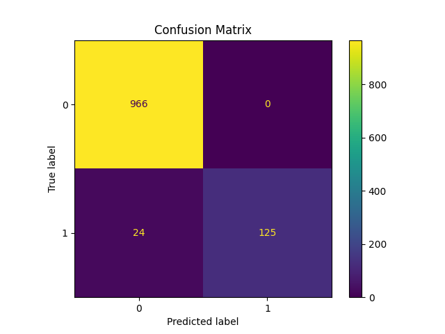

# SMS Spam Detection using NLP and Machine Learning

## Overview

This project is an NLP-based SMS Spam Detection system built using Python and Machine Learning.

The model classifies SMS messages into:
- Spam
- Ham (Normal Message)

The project uses:
- TF-IDF Vectorization
- Naive Bayes Classification
- Scikit-learn Pipeline

---

# Features

- Text preprocessing using NLP
- TF-IDF vectorization
- Spam classification
- Model training and testing
- Confusion matrix visualization
- Model saving using joblib
- Interactive prediction system

---

# Technologies Used

- Python
- Pandas
- Scikit-learn
- Matplotlib
- Joblib

---

# NLP Concepts Used

- Text Classification
- TF-IDF (Term Frequency–Inverse Document Frequency)
- Stop Word Removal
- Feature Extraction

---

# Machine Learning Algorithm

## Multinomial Naive Bayes

Naive Bayes is widely used for NLP and text classification problems because:
- Fast training
- Efficient for text data
- High accuracy

---

# Dataset

Dataset used:
SMS Spam Collection Dataset

Classes:
- spam
- ham

Example:

| Label | Message |
|------|------|
| spam | Congratulations! You won a free ticket |
| ham | Are you coming today? |

---

# Project Structure

Document-Classifier/
│
├── data/
│   └── spam_dataset.csv
│
├── images/
│   └── confusion_matrix.png
│
├── models/
│   └── model.pkl
│
├── src/
│   ├── train.py
│   └── predict.py
│
├── requirements.txt
├── README.md
└── download_dataset.py

---

# Installation

Install required libraries:

```bash
pip install -r requirements.txt
```

---

# Run the Project

## Train the Model

```bash
python src/train.py
```

---

## Predict Messages

```bash
python src/predict.py
```

---

# Model Performance

## Accuracy

97.84%

---

# Confusion Matrix



---

# Example Prediction

Input:

```text
Congratulations! You won a free iPhone
```

Output:

```text
spam
```

---

# Future Improvements

- Streamlit Web Application
- Logistic Regression comparison
- Deep Learning models
- BERT/Transformers
- Email spam detection
- Real-time deployment

---

# Author

Krishnendu M V

---

# License

I built this project to learn NLP and text classification using Machine Learning.
